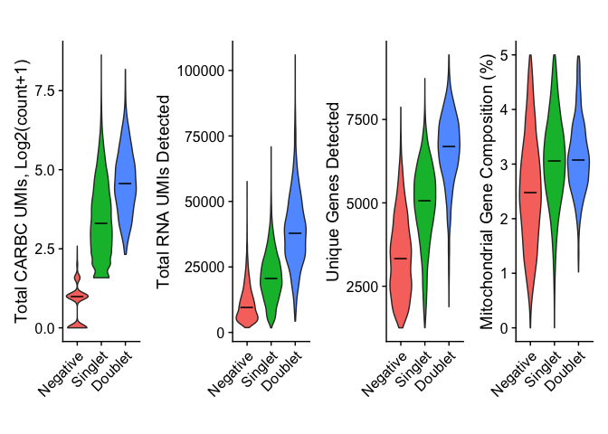
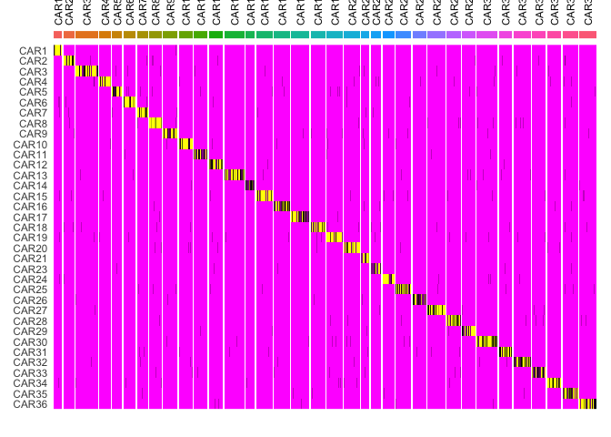
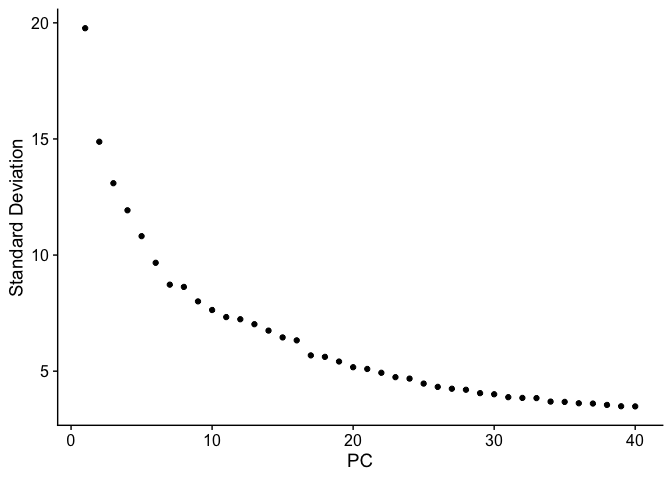
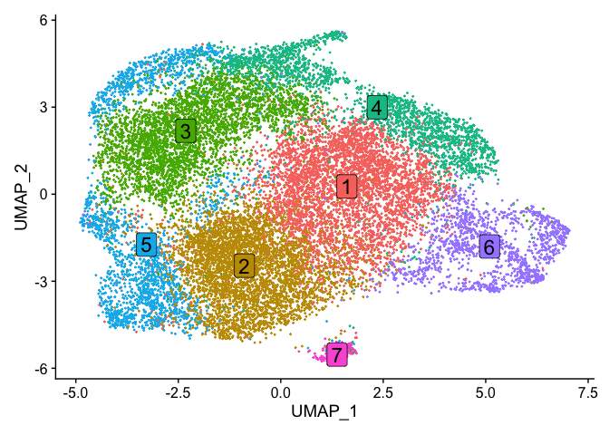
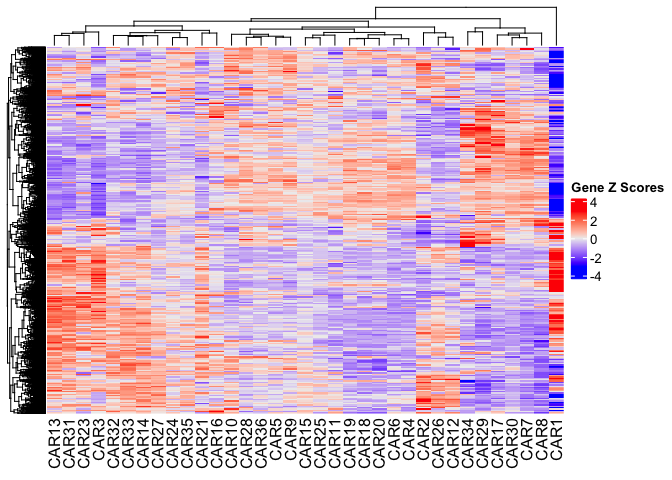
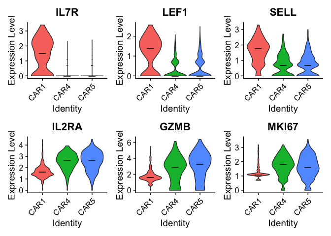

# caRNA-seq

Author: Caleb R. Perez

Compiled: October 03, 2024

Reference: [Perez et al.,
2014](https://www.biorxiv.org/content/10.1101/2024.04.29.591541v1)

## Introduction

This repository contains scripts used in the processing of caRNA-seq
datasets generated in Perez et al., 2024 (pre-printed as of May 2024).

caRNA-seq is a scRNA-seq-based platform that allows for the simultaneous
measurement of genome-wide transcriptional responses induced by a
library of diverse CAR molecules, using the detection of CAR-specific
barcodes to assign CAR identity to single cells. The functions in these
scripts provide basic functionality for caRNA-seq analysis, including
cell calling of CAR variants, as well as wrappers for conventional
scRNA-seq analysis pipelines (e.g. normalization, clustering, DEG
analysis, etc.). These are written to interface with the
[Seurat](https://satijalab.org/seurat/) scRNA-seq analysis package
(written for v4, should be compatible with v5, although this was not
tested).

For a detailed protocol on the sample preparation required to generate
paired transcriptomic and CAR barcode datasets using a 10X Genomics
Chromium platform, see
[here](https://github.com/birnbaumlab/caRNA-seq/blob/main/docs/caRNA-seq_sample_prep_protocol.pdf).

## Broad overview of scripts included in this repository

### [caRNA-seq_preprocessing.R](https://github.com/birnbaumlab/caRNA-seq/blob/main/src/caRNA-seq_analysis.R)

Provides basic dataset preprocessing functionality, including filtering
on conventional QC metrics, calling cells by HTO, and calling cells by
CAR BC. CAR identity is stored in a metadata column, labeled `CARID`.

### [caRNA-seq_analysis.R](https://github.com/birnbaumlab/caRNA-seq/blob/main/src/caRNA-seq_preprocessing.R)

Provides basic analysis functionality, including normalization,
clustering, DEG analysis, and geneset scoring, as well as functionality
for CAR-level analysis (e.g. CAR distribution analyses).

See source code for detailed documentation for each function.

## Guided caRNA-seq analysis tutorial

In this tutorial, we will walk through a simple analysis of an example
caRNA-seq dataset, in which \~29,000 T cells express one of 35 different
CD19-targeted CAR variants, the identity of which is represented by 35
unique CAR-specific barcodes (CAR BCs) encoded in the CAR transcript.
This library of CAR T cells was stimulated via coculture with CD19+
leukemia cells, then encapsulated and sequenced via a Chromium Next GEM
Single Cell 5’ Kit v2, generating a gene expression library and a CAR BC
library that were sequenced on an Illumina NovaSeq6000. The CellRanger
count pipeline (10X Genomics) was used to generate cell-feature matrices
from both libraries, in which the CAR BC library was treated as a
“Custom” feature library type (for more information, see relevant
CellRanger documentation
[here](https://www.10xgenomics.com/support/software/cell-ranger/latest/analysis/running-pipelines/cr-gex-count)
and
[here](https://www.10xgenomics.com/support/software/cell-ranger/latest/analysis/inputs/cr-libraries-csv#library-types),
and an example of the [feature reference CSV
file](https://github.com/birnbaumlab/caRNA-seq/blob/main/data/CARBC_CellRanger_feature_reference.csv)
for our library of CAR BCs that can be used for input into CellRanger).
The resulting count matrices can be found uploaded to this repository,
[here](https://github.com/birnbaumlab/caRNA-seq/blob/main/data/filtered_feature_bc_matrix.zip).
For simplicity, this data consists of cells from a single donor, making
up a subset of the data shown in Figure 2-3 of our manuscript.

We begin with data import and pre-processing. First, we import our count
matrices into a Seurat object in which transcript counts and CAR BC
counts are stored in two different assays, `RNA` and `CARBC`,
respectively. We provide support for CITE-seq data as well, which would
be stored in an `ADT` assay; if cells were hashed with barcoded
antibodies to multiplex samples, we also allow hash counts to be stored
in an `HTO` assay for easy sample demultiplexing.

``` r
# Setup working directory and source caRNA-seq scripts
repo_directory <- "/Users/caleb/Dropbox (MIT)/Birnbaum Lab/Manuscripts/caRNA-seq/GitHub"
setwd(repo_directory)
source("./src/caRNA-seq_preprocessing.R")
source("./src/caRNA-seq_analysis.R")

# Import data and create Seurat object under default settings
seurat_obj <- create_seurat(mat_path = "./data/filtered_feature_bc_matrix")
```

    ## Importing 10X Data...

Next, we can filter out low-quality cells based on basic QC metrics
drawn from the gene expression library. Here, we will use a minimum
threshold of 1250 unique genes detected in each cell, and a maximum
threshold of 5% of transcript counts coming from mitochondrial genes;
each cell batch and sequencing dataset will differ on these thresholds,
so we recommend optimization for your own applications.

``` r
# Filter out low-quality cells on the basis of unique genes and mitochondrial reads
seurat_obj <- filter_seurat(seurat_obj, unique_gene_thresh = 1250, mt_thresh = 5)
```

    ## Settings: Mitochondrial % = 5, Unique Gene Count = 1250.
    ## Starting cell count: 28987.
    ## Filtered cell count: 24991.
    ## Filtered CAR library representation:
    ##  CAR1  CAR2  CAR3  CAR4  CAR5  CAR6  CAR7  CAR8  CAR9 CAR10 CAR11 CAR12 CAR13 
    ##  2300   574  1102   518   625   643   622   670   683   616   702   555   734 
    ## CAR14 CAR15 CAR16 CAR17 CAR18 CAR19 CAR20 CAR21 CAR23 CAR24 CAR25 CAR26 CAR27 
    ##   476   766   746   705   670   715   711   422   417   657   729   657   807 
    ## CAR28 CAR29 CAR30 CAR31 CAR32 CAR33 CAR34 CAR35 CAR36 
    ##   598   659   827   624   801   717   626   660   657

As a final pre-processing step, we identify CARs expressed by each cell
on the basis of CAR BC counts, utilizing the
[MULTIseqDemux](https://satijalab.org/seurat/reference/multiseqdemux)
algorithm. For each cell, this identifies which CAR BCs are expressed
over background levels, allowing discrimination of cells expressing only
a single CAR (`Singlet`) from those expressing multiple (`Doublet`), or
those expressing none (`Negative`). By default, we keep only cells
expressing a single CAR for downstream analysis. We also output a
heatmap describing the results the

``` r
# Assign each cell to individual CARs on the basis of CAR BC expression
seurat_obj <- CAR_demux(seurat_obj)
```

    ## Normalizing CAR BC counts...
    ## Filtering CAR BC Matrix with  MULTISeq  algorithm ...
    ## Starting cell count: 24991.
    ## Singlet distribution is as follows:
    ## 
    ## Negative  Singlet  Doublet 
    ##     4789    18247     1955

<!-- -->

    ## Filtering out negatives and doublets...
    ## Singlet cell count: 18247.
    ## Final CAR library representation:
    ##  CAR1  CAR2  CAR3  CAR4  CAR5  CAR6  CAR7  CAR8  CAR9 CAR10 CAR11 CAR12 CAR13 
    ##   254   447   865   399   457   491   476   503   543   486   553   434   585 
    ## CAR14 CAR15 CAR16 CAR17 CAR18 CAR19 CAR20 CAR21 CAR23 CAR24 CAR25 CAR26 CAR27 
    ##   345   613   621   561   532   566   588   317   282   524   615   503   668 
    ## CAR28 CAR29 CAR30 CAR31 CAR32 CAR33 CAR34 CAR35 CAR36 
    ##   476   530   693   502   661   535   522   549   551

<!-- -->

Following this pre-processing pipeline, we are left only with high
quality cells that were confidently called to a single CAR in the
library. The Seurat object we generated can be easily input into in any
Seurat-compatible pipeline as desired for downstream analysis; we also
provide a series of wrappers for commonly used Seurat functions to
simplify this process. Here we will outline one analysis pipeline to
explore CAR-intrinsic transcriptional profiles, by comparing average
transcriptional profiles across CARs using pseudobulking.

We begin by normalizing our transcriptional data; by default, we use the
Seurat SCTransform algorithm, but our wrapper also provides support for
log-normalization. At this point, we also identify variable genes. By
default, we filter out TCR genes from these variable features to avoid
clonality driving clustering or other downstream analysis.

``` r
# Normalize gene expression counts and identify variable genes
seurat_obj <- normalize(seurat_obj, workflow = "SCT", filter_variable_genes = "TCR")
```

At this point, you could then proceed to dimensionality reduction and
unsupervised clustering of cells. By default, our wrappers use the
Leiden algorithm on the basis of the first 30 PCs, but we encourage
optimization for each dataset. Cluster markers, alongside CAR membership
within individual clusters, can then be analyzed to reveal CAR-specific
signals.

``` r
# PCA and cluster
seurat_obj <- seurat_obj %>%
    pca() %>%
    cluster(resolution = 0.4)
```

    ## Performing PCA on gene expression...
    ## Variance explained by PCs...
    ##  [1] 0.1734916 0.2717880 0.3479042 0.4110674 0.4629839 0.5044697 0.5382699
    ##  [8] 0.5713199 0.5997713 0.6256455 0.6494979 0.6727453 0.6946395 0.7148497
    ## [15] 0.7333403 0.7511141 0.7654362 0.7794401 0.7924609 0.8043323 0.8158576
    ## [22] 0.8266533 0.8366376 0.8463649 0.8552188 0.8635188 0.8715150 0.8793458
    ## [29] 0.8866450 0.8937716 0.9004574 0.9070325 0.9135826 0.9196287 0.9256317
    ## [36] 0.9314466 0.9372194 0.9428034 0.9482103 0.9535971 0.9587774 0.9637431
    ## [43] 0.9685754 0.9733097 0.9779606 0.9825761 0.9871071 0.9914792 0.9957825
    ## [50] 1.0000000

<!-- --><!-- -->

For the sake of this tutorial, we will take a simpler approach, in which
we calculate the pseudobulked average gene expression profiles for each
CAR in the library. We can do this using the `compute_pb_avg()`
function. By default, we pseudobulk normalized transcript counts across
all cells expressing each CAR (`group.by = ‘CARID’`), utilizing only
variable genes, and we scale the results to allow for easy visualization
of Z-scores in a heatmap. For visualization, we typically use the
[ComplexHeatmap](https://jokergoo.github.io/ComplexHeatmap-reference/book/index.html)
package.

``` r
# Pseudobulk by CAR to calculate average gene expression profiles across all cells expressing
# each CAR
pb_data <- compute_pb_avg(seurat_obj, group.by = "CARID", features = VariableFeatures(seurat_obj))

# Visualize average expression profiles by CAR
ComplexHeatmap::Heatmap(pb_data, name = "Gene Z Scores", show_row_names = F)
```

<!-- -->

Alternatively, within a single function call, we can compute
pseudobulked data and visualize the results:

``` r
DoAverageHeatmap(seurat_obj, group.by = "CARID", features = VariableFeatures(seurat_obj), show_row_names = F,
    name = "Gene Z Scores")
```

<!-- -->

This analysis seems to suggest that CAR1 drives a unique transcriptional
profile. We can look specifically at the genes driving this signature
using differential gene expression analysis, computing genes
significantly over or underexpressed in cells expressing CAR1 relative
to those expressing all other CARs:

``` r
# Perform DEG analysis, CAR1 vs. all other CARs
CAR1_markers <- CAR_markers(seurat_obj, CAR.1 = "CAR1")

# Look at top 10 overexpressed genes
head(CAR1_markers, n = 10)
```

    ##                    p_val avg_log2FC pct.1 pct.2     p_val_adj
    ## IL7R       1.959970e-124   2.099397 0.701 0.188 4.621414e-120
    ## LTB         2.580341e-82   1.776777 0.972 0.610  6.084187e-78
    ## PNRC1       1.853727e-85   1.480340 0.866 0.471  4.370902e-81
    ## NOSIP       2.223669e-69   1.422754 0.988 0.865  5.243189e-65
    ## AQP3       1.718876e-104   1.403325 0.650 0.182 4.052939e-100
    ## PCED1B-AS1  6.237975e-63   1.368544 0.768 0.449  1.470852e-58
    ## LIME1       8.889410e-51   1.241534 0.815 0.486  2.096034e-46
    ## GIMAP4      1.237849e-65   1.215160 0.933 0.567  2.918723e-61
    ## YPEL3       3.614119e-65   1.170090 0.866 0.533  8.521732e-61
    ## TXNIP       1.906662e-62   1.151808 0.992 0.828  4.495719e-58

``` r
# Look at top 10 underexpressed genes
tail(CAR1_markers, n = 10)
```

    ##                 p_val avg_log2FC pct.1 pct.2    p_val_adj
    ## ISG15    6.240956e-64  -1.055264 0.988 0.998 1.471555e-59
    ## MX1      8.483363e-84  -1.067284 0.996 0.999 2.000292e-79
    ## IL2RA    1.100385e-33  -1.073910 0.992 0.975 2.594598e-29
    ## CYP1B1   3.451776e-11  -1.097348 0.193 0.368 8.138943e-07
    ## IFNG     1.455891e-12  -1.122511 0.020 0.197 3.432844e-08
    ## HSP90AB1 2.865721e-66  -1.131988 1.000 1.000 6.757083e-62
    ## TUBA1B   2.299559e-71  -1.255053 1.000 1.000 5.422131e-67
    ## IFI6     7.963077e-88  -1.279936 0.992 1.000 1.877614e-83
    ## IL13     6.860062e-13  -1.817887 0.059 0.251 1.617534e-08
    ## GZMB     2.191721e-16  -1.862909 0.988 0.874 5.167859e-12

And we find that these marker genes make sense biologically, as CAR1 is
in fact the signaling-deficient negative control that we built into our
library. Without any signaling domains to drive activation upon antigen
binding, it follows that cells expressing this particular construct
would show reduced expression of activation markers and increased
expression of genes associated with naïve, unactivated T cells, when
compared to the other functional CARs in the library. We can visualize
these differences explicitly by comparing CAR1-expressing cells to those
that express the two clinically approved CAR architectures, which are
encoded in our library as CAR4 and CAR5 (1928z and 19BBz CARs,
respectively).

``` r
# Visualize expression of these markers compared to CAR4 and 5 (1928z and 19BBz,
# clinically-approved pos. ctrls)
Idents(seurat_obj) <- "CARID"
vln_median(seurat_obj, features = c("IL7R", "LEF1", "SELL", "IL2RA", "GZMB", "MKI67"), idents = c("CAR1",
    "CAR4", "CAR5"))
```

<!-- -->

## Session Info

<details>
<summary>
Session Info
</summary>

``` r
sessionInfo()
```

    ## R version 4.2.2 (2022-10-31)
    ## Platform: aarch64-apple-darwin20 (64-bit)
    ## Running under: macOS Ventura 13.1
    ## 
    ## Matrix products: default
    ## BLAS:   /Library/Frameworks/R.framework/Versions/4.2-arm64/Resources/lib/libRblas.0.dylib
    ## LAPACK: /Library/Frameworks/R.framework/Versions/4.2-arm64/Resources/lib/libRlapack.dylib
    ## 
    ## locale:
    ## [1] en_US.UTF-8/en_US.UTF-8/en_US.UTF-8/C/en_US.UTF-8/en_US.UTF-8
    ## 
    ## attached base packages:
    ## [1] grid      stats4    stats     graphics  grDevices utils     datasets 
    ## [8] methods   base     
    ## 
    ## other attached packages:
    ##  [1] factoextra_1.0.7            circlize_0.4.15            
    ##  [3] ComplexHeatmap_2.12.1       UCell_2.2.0                
    ##  [5] GSVA_1.44.5                 GSEABase_1.58.0            
    ##  [7] graph_1.74.0                annotate_1.76.0            
    ##  [9] XML_3.99-0.14               AnnotationDbi_1.60.2       
    ## [11] ggpubr_0.6.0                tigerstats_0.3.2           
    ## [13] abd_0.2-8                   mosaic_1.8.4.2             
    ## [15] mosaicData_0.20.3           ggformula_0.10.4           
    ## [17] Matrix_1.6-0                lattice_0.21-8             
    ## [19] nlme_3.1-162                EnhancedVolcano_1.14.0     
    ## [21] harmony_0.1.1               Rcpp_1.0.11                
    ## [23] DESeq2_1.36.0               SummarizedExperiment_1.28.0
    ## [25] Biobase_2.58.0              MatrixGenerics_1.10.0      
    ## [27] GenomicRanges_1.50.2        GenomeInfoDb_1.34.9        
    ## [29] IRanges_2.32.0              S4Vectors_0.36.2           
    ## [31] BiocGenerics_0.44.0         pheatmap_1.0.12            
    ## [33] ggrepel_0.9.3               clustree_0.5.0             
    ## [35] ggraph_2.1.0                sctransform_0.3.5          
    ## [37] gtools_3.9.4                matrixStats_1.0.0          
    ## [39] SeuratObject_4.1.3          Seurat_4.3.0.1             
    ## [41] lubridate_1.9.2             forcats_1.0.0              
    ## [43] stringr_1.5.0               dplyr_1.1.2                
    ## [45] purrr_1.0.1                 readr_2.1.4                
    ## [47] tidyr_1.3.0                 tibble_3.2.1               
    ## [49] ggplot2_3.4.2               tidyverse_2.0.0            
    ## 
    ## loaded via a namespace (and not attached):
    ##   [1] scattermore_1.2             R.methodsS3_1.8.2          
    ##   [3] bit64_4.0.5                 knitr_1.43                 
    ##   [5] R.utils_2.12.2              irlba_2.3.5.1              
    ##   [7] DelayedArray_0.24.0         data.table_1.14.8          
    ##   [9] KEGGREST_1.38.0             RCurl_1.98-1.12            
    ##  [11] doParallel_1.0.17           generics_0.1.3             
    ##  [13] ScaledMatrix_1.4.1          cowplot_1.1.1              
    ##  [15] RSQLite_2.3.1               RANN_2.6.1                 
    ##  [17] future_1.33.0               bit_4.0.5                  
    ##  [19] tzdb_0.4.0                  spatstat.data_3.0-1        
    ##  [21] httpuv_1.6.11               viridis_0.6.4              
    ##  [23] xfun_0.39                   hms_1.1.3                  
    ##  [25] evaluate_0.21               promises_1.2.0.1           
    ##  [27] fansi_1.0.4                 igraph_1.5.0.1             
    ##  [29] DBI_1.1.3                   geneplotter_1.74.0         
    ##  [31] htmlwidgets_1.6.2           spatstat.geom_3.2-4        
    ##  [33] ellipsis_0.3.2              backports_1.4.1            
    ##  [35] deldir_1.0-9                sparseMatrixStats_1.10.0   
    ##  [37] vctrs_0.6.3                 SingleCellExperiment_1.20.1
    ##  [39] ROCR_1.0-11                 abind_1.4-5                
    ##  [41] cachem_1.0.8                withr_2.5.0                
    ##  [43] ggforce_0.4.1               progressr_0.13.0           
    ##  [45] goftest_1.2-3               cluster_2.1.4              
    ##  [47] lazyeval_0.2.2              crayon_1.5.2               
    ##  [49] genefilter_1.78.0           spatstat.explore_3.2-1     
    ##  [51] labeling_0.4.2              pkgconfig_2.0.3            
    ##  [53] tweenr_2.0.2                rlang_1.1.1                
    ##  [55] globals_0.16.2              lifecycle_1.0.3            
    ##  [57] miniUI_0.1.1.1              rsvd_1.0.5                 
    ##  [59] polyclip_1.10-4             lmtest_0.9-40              
    ##  [61] carData_3.0-5               Rhdf5lib_1.20.0            
    ##  [63] zoo_1.8-12                  ggridges_0.5.4             
    ##  [65] GlobalOptions_0.1.2         png_0.1-8                  
    ##  [67] viridisLite_0.4.2           rjson_0.2.21               
    ##  [69] bitops_1.0-7                R.oo_1.25.0                
    ##  [71] KernSmooth_2.23-22          rhdf5filters_1.10.1        
    ##  [73] Biostrings_2.66.0           blob_1.2.4                 
    ##  [75] DelayedMatrixStats_1.20.0   shape_1.4.6                
    ##  [77] parallelly_1.36.0           spatstat.random_3.1-5      
    ##  [79] rstatix_0.7.2               ggsignif_0.6.4             
    ##  [81] beachmat_2.14.2             scales_1.2.1               
    ##  [83] memoise_2.0.1               magrittr_2.0.3             
    ##  [85] plyr_1.8.8                  ica_1.0-3                  
    ##  [87] zlibbioc_1.44.0             compiler_4.2.2             
    ##  [89] RColorBrewer_1.1-3          clue_0.3-64                
    ##  [91] fitdistrplus_1.1-11         cli_3.6.1                  
    ##  [93] XVector_0.38.0              listenv_0.9.0              
    ##  [95] patchwork_1.1.2             pbapply_1.7-2              
    ##  [97] formatR_1.14                MASS_7.3-60                
    ##  [99] tidyselect_1.2.0            stringi_1.7.12             
    ## [101] glmGamPoi_1.10.2            highr_0.10                 
    ## [103] yaml_2.3.7                  BiocSingular_1.12.0        
    ## [105] locfit_1.5-9.8              manipulate_1.0.1           
    ## [107] tools_4.2.2                 timechange_0.2.0           
    ## [109] future.apply_1.11.0         parallel_4.2.2             
    ## [111] rstudioapi_0.15.0           foreach_1.5.2              
    ## [113] gridExtra_2.3               farver_2.1.1               
    ## [115] Rtsne_0.16                  digest_0.6.33              
    ## [117] shiny_1.7.4.1               car_3.1-2                  
    ## [119] broom_1.0.5                 later_1.3.1                
    ## [121] RcppAnnoy_0.0.21            httr_1.4.6                 
    ## [123] ggstance_0.3.6              colorspace_2.1-0           
    ## [125] tensor_1.5                  reticulate_1.30            
    ## [127] splines_4.2.2               uwot_0.1.16                
    ## [129] spatstat.utils_3.0-3        graphlayouts_1.0.0         
    ## [131] sp_2.0-0                    plotly_4.10.2              
    ## [133] xtable_1.8-4                jsonlite_1.8.7             
    ## [135] tidygraph_1.2.3             R6_2.5.1                   
    ## [137] pillar_1.9.0                htmltools_0.5.5            
    ## [139] mime_0.12                   glue_1.6.2                 
    ## [141] fastmap_1.1.1               BiocParallel_1.32.6        
    ## [143] BiocNeighbors_1.14.0        codetools_0.2-19           
    ## [145] utf8_1.2.3                  spatstat.sparse_3.0-2      
    ## [147] leiden_0.4.3                limma_3.52.4               
    ## [149] survival_3.5-5              rmarkdown_2.23             
    ## [151] munsell_0.5.0               GetoptLong_1.0.5           
    ## [153] rhdf5_2.42.1                GenomeInfoDbData_1.2.9     
    ## [155] iterators_1.0.14            HDF5Array_1.26.0           
    ## [157] labelled_2.12.0             haven_2.5.3                
    ## [159] reshape2_1.4.4              mosaicCore_0.9.2.1         
    ## [161] gtable_0.3.3

</details>
